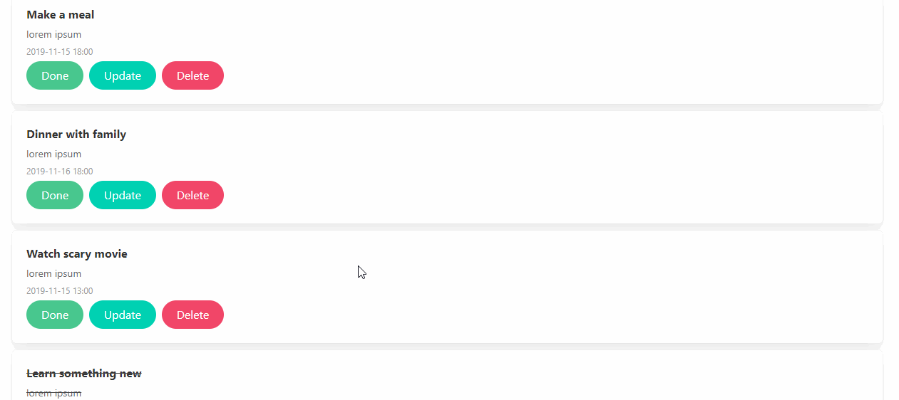
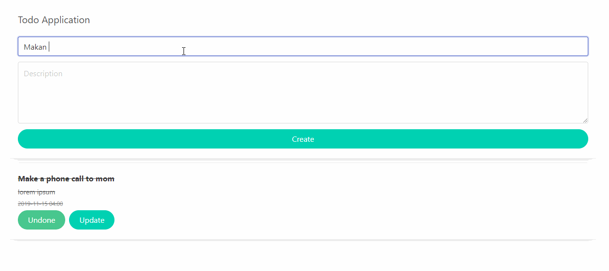
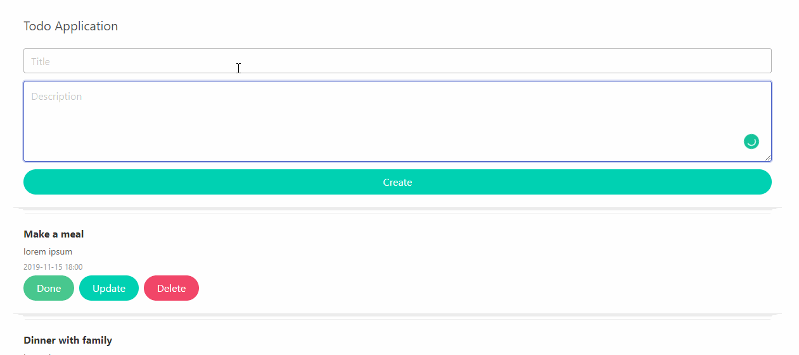

# Simple Todo Application With React And Bulma Components
A repository for simple todo application using technology stack react, bulma components.  

How to get started to running these application on your localhost, please following this guide:
1. install dependencies:  
`
$ npm install
`  
2. after the dependencies installed, you can run the application:  
`
$ npm run start
`  
and for the result will be appear like these

(image: process update, delete and done your todo task)

(image: process input todo task)

(image: show modal if input empty)